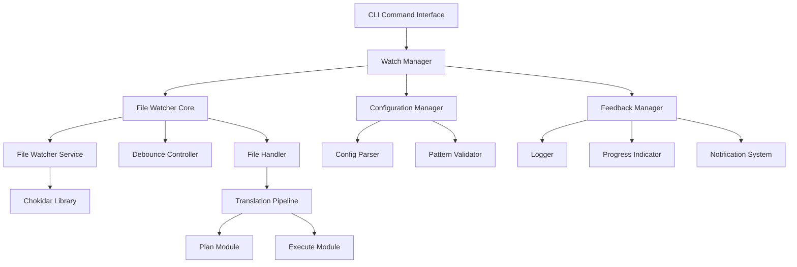

# Design Document

## Overview

The File Watching & Auto-retranslation feature builds upon the existing watch mode implementation in the Lingo.dev CLI to provide enhanced file monitoring capabilities with improved performance, configurability, and developer experience. The design leverages the current architecture while adding new components for advanced file watching patterns, configuration management, and real-time feedback systems.

The feature integrates seamlessly with the existing CLI command structure, extending the current `lingo.dev run --watch` functionality with additional configuration options, better error handling, and enhanced monitoring capabilities.

## Architecture

### High-Level Architecture



### Component Integration

The design extends the existing CLI architecture by:

1. **Enhancing the existing watch.ts module** with improved configuration and error handling
2. **Adding new configuration management** for watch-specific settings
3. **Implementing advanced file pattern matching** beyond the current bucket-based approach
4. **Creating a feedback system** for real-time developer notifications
5. **Maintaining compatibility** with all existing CLI flags and functionality

## Components and Interfaces

### 1. Enhanced Watch Manager

**Location**: `packages/cli/src/cli/cmd/run/watch/manager.ts`

```typescript
interface WatchManager {
  start(ctx: CmdRunContext): Promise<void>;
  stop(): Promise<void>;
  getStatus(): WatchStatus;
  updateConfiguration(config: WatchConfiguration): Promise<void>;
}

interface WatchStatus {
  isActive: boolean;
  watchedFiles: string[];
  pendingChanges: string[];
  lastActivity: Date;
  errorCount: number;
}
```

**Responsibilities**:
- Orchestrate file watching lifecycle
- Manage watch state and configuration
- Coordinate between file watcher and translation pipeline
- Handle graceful shutdown and cleanup

### 2. Configuration Manager

**Location**: `packages/cli/src/cli/cmd/run/watch/config.ts`

```typescript
interface WatchConfiguration {
  patterns: {
    include: string[];
    exclude: string[];
  };
  debounce: {
    delay: number;
    maxWait?: number;
  };
  monitoring: {
    enableProgressIndicators: boolean;
    enableNotifications: boolean;
    logLevel: 'silent' | 'minimal' | 'verbose';
  };
  performance: {
    batchSize: number;
    rateLimitDelay: number;
  };
}

interface ConfigurationManager {
  loadConfiguration(ctx: CmdRunContext): WatchConfiguration;
  validateConfiguration(config: WatchConfiguration): ValidationResult;
  mergeWithDefaults(config: Partial<WatchConfiguration>): WatchConfiguration;
}
```

**Responsibilities**:
- Parse and validate watch configuration from CLI flags and config files
- Provide sensible defaults for all configuration options
- Support configuration updates without restart
- Validate file patterns and settings

### 3. Enhanced File Watcher Service

**Location**: `packages/cli/src/cli/cmd/run/watch/watcher.ts`

```typescript
interface FileWatcherService {
  initialize(patterns: string[], options: WatchOptions): Promise<void>;
  addPattern(pattern: string): Promise<void>;
  removePattern(pattern: string): Promise<void>;
  getWatchedFiles(): string[];
  destroy(): Promise<void>;
}

interface WatchOptions {
  debounceDelay: number;
  ignoreInitial: boolean;
  awaitWriteFinish: {
    stabilityThreshold: number;
    pollInterval: number;
  };
  ignored: string[];
}

interface FileChangeEvent {
  type: 'add' | 'change' | 'unlink' | 'addDir' | 'unlinkDir';
  path: string;
  timestamp: Date;
  stats?: fs.Stats;
}
```

**Responsibilities**:
- Wrap chokidar with enhanced error handling and recovery
- Implement advanced debouncing strategies
- Handle file system edge cases (temporary files, rapid changes)
- Provide detailed change event information

### 4. Debounce Controller

**Location**: `packages/cli/src/cli/cmd/run/watch/debounce.ts`

```typescript
interface DebounceController {
  scheduleRetranslation(changes: FileChangeEvent[]): void;
  cancelPending(): void;
  isRetranslationPending(): boolean;
  getTimeUntilExecution(): number;
}

interface DebounceStrategy {
  type: 'simple' | 'adaptive' | 'batch';
  delay: number;
  maxWait?: number;
  batchSize?: number;
}
```

**Responsibilities**:
- Implement configurable debouncing strategies
- Batch multiple file changes efficiently
- Prevent excessive retranslation during bulk operations
- Support adaptive debouncing based on change frequency

### 5. Feedback Manager

**Location**: `packages/cli/src/cli/cmd/run/watch/feedback.ts`

```typescript
interface FeedbackManager {
  reportFileChange(event: FileChangeEvent): void;
  reportRetranslationStart(files: string[]): void;
  reportRetranslationProgress(progress: TranslationProgress): void;
  reportRetranslationComplete(result: TranslationResult): void;
  reportError(error: WatchError): void;
}

interface TranslationProgress {
  totalTasks: number;
  completedTasks: number;
  currentTask?: string;
  estimatedTimeRemaining?: number;
}

interface WatchError {
  type: 'file_system' | 'translation' | 'configuration';
  message: string;
  path?: string;
  recoverable: boolean;
}
```

**Responsibilities**:
- Provide real-time feedback to developers
- Display progress indicators during retranslation
- Log detailed information for debugging
- Handle different verbosity levels

### 6. Pattern Resolver

**Location**: `packages/cli/src/cli/cmd/run/watch/patterns.ts`

```typescript
interface PatternResolver {
  resolveWatchPatterns(ctx: CmdRunContext): Promise<ResolvedPatterns>;
  validatePatterns(patterns: string[]): ValidationResult;
  expandGlobPatterns(patterns: string[]): Promise<string[]>;
}

interface ResolvedPatterns {
  include: string[];
  exclude: string[];
  resolved: string[];
}
```

**Responsibilities**:
- Convert bucket configurations to file watch patterns
- Handle glob pattern expansion and validation
- Apply include/exclude filters from CLI flags
- Resolve locale placeholders in patterns

## Data Models

### Enhanced Watch Context

```typescript
interface EnhancedWatchContext extends CmdRunContext {
  watchConfig: WatchConfiguration;
  watchState: WatchState;
  feedbackManager: FeedbackManager;
}

interface WatchState {
  isRunning: boolean;
  isRetranslating: boolean;
  pendingChanges: Map<string, FileChangeEvent>;
  watchedPatterns: string[];
  startTime: Date;
  lastRetranslation?: Date;
  statistics: WatchStatistics;
}

interface WatchStatistics {
  totalChanges: number;
  retranslationCount: number;
  errorCount: number;
  averageRetranslationTime: number;
}
```

### Configuration Schema Extensions

```typescript
// Extend existing flagsSchema in _types.ts
const enhancedFlagsSchema = flagsSchema.extend({
  // Enhanced watch options
  watchInclude: z.array(z.string()).optional(),
  watchExclude: z.array(z.string()).optional(),
  watchConfig: z.string().optional(), // Path to watch config file
  
  // Advanced debouncing
  debounceStrategy: z.enum(['simple', 'adaptive', 'batch']).default('simple'),
  maxWait: z.number().positive().optional(),
  
  // Feedback options
  quiet: z.boolean().default(false),
  progress: z.boolean().default(true),
  notifications: z.boolean().default(false),
  
  // Performance tuning
  batchSize: z.number().positive().default(50),
  rateLimitDelay: z.number().positive().default(100),
});
```

## Error Handling

### Error Categories and Recovery Strategies

1. **File System Errors**
   - **Temporary file access issues**: Retry with exponential backoff
   - **Permission errors**: Log error and continue watching other files
   - **Directory deletion**: Attempt to re-establish watch on parent directory
   - **Network drive disconnection**: Implement reconnection logic

2. **Translation Pipeline Errors**
   - **API failures**: Continue watching, report error, retry on next change
   - **Configuration errors**: Stop watching, report configuration issues
   - **Resource exhaustion**: Implement rate limiting and queue management

3. **Configuration Errors**
   - **Invalid patterns**: Validate and report specific pattern issues
   - **Missing files**: Warn but continue with available patterns
   - **Permission issues**: Graceful degradation with user notification

### Error Recovery Implementation

```typescript
interface ErrorRecoveryStrategy {
  maxRetries: number;
  backoffMultiplier: number;
  recoveryActions: RecoveryAction[];
}

interface RecoveryAction {
  condition: (error: Error) => boolean;
  action: (error: Error) => Promise<void>;
  description: string;
}
```

## Testing Strategy

### Unit Testing

1. **Configuration Manager Tests**
   - Configuration parsing and validation
   - Default value application
   - Pattern resolution and validation

2. **Debounce Controller Tests**
   - Different debouncing strategies
   - Batch processing logic
   - Timer management and cancellation

3. **Pattern Resolver Tests**
   - Glob pattern expansion
   - Locale placeholder replacement
   - Include/exclude filter application

4. **Feedback Manager Tests**
   - Message formatting and output
   - Progress calculation and reporting
   - Error categorization and handling

### Integration Testing

1. **File Watcher Integration**
   - File change detection accuracy
   - Debouncing behavior with real file operations
   - Error handling during file system stress

2. **Translation Pipeline Integration**
   - End-to-end retranslation workflow
   - Context preservation between watch cycles
   - Resource cleanup and state management

3. **CLI Integration**
   - Flag parsing and configuration merging
   - Graceful shutdown handling
   - Compatibility with existing CLI features

### Performance Testing

1. **Large File Set Monitoring**
   - Watch performance with 1000+ files
   - Memory usage during extended monitoring
   - CPU usage during bulk file changes

2. **Rapid Change Handling**
   - Debouncing effectiveness during rapid changes
   - Queue management under load
   - Rate limiting behavior

3. **Long-Running Stability**
   - Memory leak detection over 24+ hour runs
   - Error recovery after extended operation
   - Resource cleanup verification

## Implementation Phases

### Phase 1: Enhanced Core Infrastructure
- Refactor existing watch.ts into modular components
- Implement enhanced configuration management
- Add comprehensive error handling and recovery
- Create feedback manager with improved logging

### Phase 2: Advanced File Watching
- Implement pattern resolver with advanced glob support
- Add configurable debouncing strategies
- Enhance file change detection and filtering
- Add performance monitoring and statistics

### Phase 3: Developer Experience Improvements
- Add progress indicators and real-time feedback
- Implement notification system for long-running operations
- Add configuration file support for complex setups
- Create debugging and diagnostic tools

### Phase 4: Performance and Reliability
- Implement rate limiting and batch processing
- Add comprehensive error recovery mechanisms
- Optimize memory usage for large file sets
- Add performance profiling and optimization

## Compatibility and Migration

### Backward Compatibility
- All existing CLI flags and behavior remain unchanged
- Current watch mode functionality preserved as default behavior
- Gradual opt-in to enhanced features through new flags
- Existing i18n.json configurations continue to work

### Migration Path
- Enhanced features available through new CLI flags
- Optional configuration file for advanced setups
- Deprecation warnings for any changed behavior
- Documentation and examples for migration

## Security Considerations

### File System Access
- Validate all file patterns to prevent directory traversal
- Implement safe path resolution for watch patterns
- Limit file system access to configured directories
- Handle symbolic links securely

### Resource Management
- Implement limits on number of watched files
- Add memory usage monitoring and limits
- Prevent excessive CPU usage during bulk operations
- Implement graceful degradation under resource constraints

### Configuration Security
- Validate configuration file contents
- Sanitize user-provided patterns and paths
- Implement secure defaults for all options
- Prevent configuration injection attacks