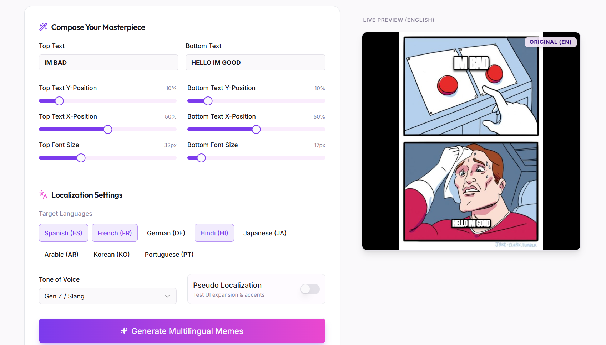
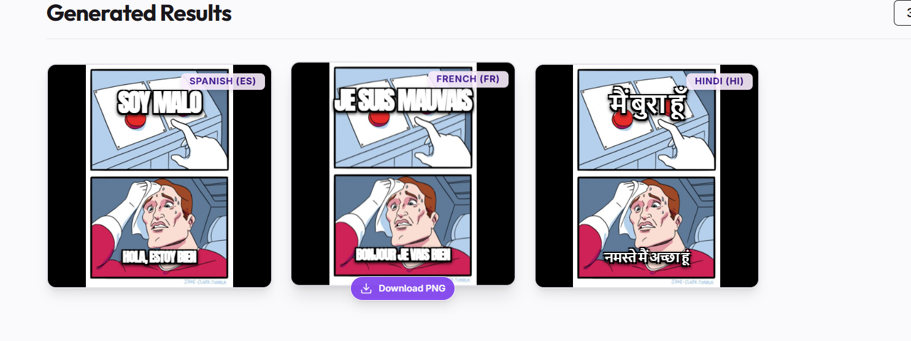

# Meme-Lingo: Multilingual Meme Generator

A fun, interactive demo showcasing **Lingo.dev**'s capabilities for React applications. Create memes and instantly translate them into 8+ languages using AI-powered localization.

## 🚀 Demo Features

- **Meme Gallery**: Choose from classic meme templates.
- **Visual Editor**: Add top/bottom text with instant preview.
- **Multilingual Support**: Translate memes into Spanish, French, German, Hindi, Japanese, Arabic, Korean, and Portuguese.
- **AI-Powered**: Uses **Lingo.dev SDK** for runtime translation with tone context (Normal, GenZ, Pirate, etc.).
- **Pseudo Localization**: Toggle UI stress-testing mode to see how different languages affect layout.
- **Download**: Export your translated memes as PNGs.

## 📸 Screenshots


*Meme Editor with language selection*


*Generated memes in multiple languages*

## 🛠️ Setup & Running

1. **Install dependencies**:
   ```bash
   npm install
   ```

2. **Environment Setup**:
   Create a `.env` file in the root directory and add your Lingo.dev API key:
   ```bash
   VITE_LINGODOTDEV_API_KEY=your_api_key_here
   ```
   *(If no key is provided, the app uses a mock fallback mode)*

3. **Run the development server**:
   ```bash
   npm run dev
   ```

4. **Open in browser**:
   Visit `http://localhost:5000` (or the URL provided by Vite).

## 🌍 Lingo.dev Features Highlighted

This demo implements two core aspects of Lingo.dev:

1.  **Runtime Translation (SDK)**:
    -   We use the `lingo.dev` SDK to translate user-generated content (meme text) on the fly.
    -   Demonstrates how to handle dynamic content that can't be pre-compiled.
    -   Supports context-aware translation (e.g., "Pirate" tone).

2.  **Pseudo Localization**:
    -   Includes a "Pseudo Localization" toggle to simulate text expansion and accented characters.
    -   This mimics the `lingo.dev i18n --pseudo` CLI command capability, allowing developers to test UI robustness without waiting for real translations.

## 💡 Why this demo is useful

Building multilingual apps usually involves painful key extraction and context switching. **Meme-Lingo** shows how Lingo.dev simplifies this:

-   **No key extraction**: We just pass text to the SDK.
-   **Context-aware**: Translations aren't just literal; they can adapt to the "meme" tone.
-   **Developer Experience**: Pseudo-localization helps catch UI bugs early.

## ⚡ How Lingo.dev makes this easy

Instead of managing thousands of JSON key-value pairs, Lingo.dev allows you to:
1.  **Compile** static text automatically (via the Compiler/CLI).
2.  **Translate** dynamic text instantly (via the SDK).

This project focuses on the **SDK** for dynamic meme text generation, proving that adding AI translation to a React app can be done in minutes.

---

Built with ❤️ using React, TailwindCSS, and [Lingo.dev](https://lingo.dev).
