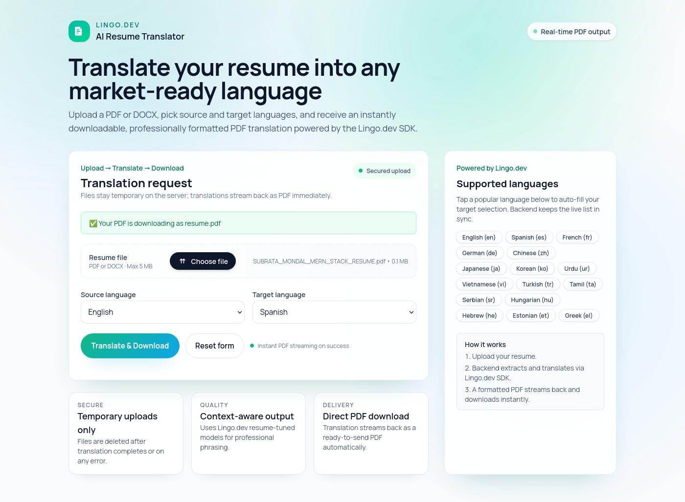

# 🌍 AI Resume Translator

Translate a resume (PDF or DOCX) between languages and instantly download a professionally formatted PDF — powered by the **Lingo.dev SDK**.

## Previews



- Before (original resume): [assets/SUBRATA_MONDAL_MERN_STACK_RESUME.pdf](assets/SUBRATA_MONDAL_MERN_STACK_RESUME.pdf)
- After (Spanish translation): [assets/SUBRATA_MONDAL_MERN_STACK_RESUME_SPANISH.pdf](assets/SUBRATA_MONDAL_MERN_STACK_RESUME_SPANISH.pdf)

## 📖 What It Does

1. **Upload**: Accepts PDF or DOCX resumes from a simple web UI.
2. **Extract**: Parses and extracts text server‑side (PDF/DOCX aware).
3. **Translate**: Sends content to the **Lingo.dev SDK** for context‑aware translation.
4. **Deliver**: Streams back a ready‑to‑download translated PDF.

**Use case**: Quickly produce professional, localized resumes for international applications.

## 🎯 Lingo.dev Features Highlighted

- **TypeScript SDK**: First‑class types and ergonomic client.
- **Context‑aware translation**: Tuned for professional/resume content.
- **Multi‑language**: Translate between various languages supported by Lingo.dev.

## 🚀 Run Locally

### Prerequisites

- Node.js v20 or higher
- npm
- Docker (optional, for containerized setup)
- Lingo.dev API key ([Get one here](https://lingo.dev/))

### Setup Steps

1. **Clone and install**

   ```bash
   git clone https://github.com/lingodotdev/lingo.dev.git
   cd lingo.dev/community/ai-resume-translator
   npm install
   ```

2. **Configure environment**

   Create a `.env` file in the root directory:

   ```env
   PORT=8000
   ORIGIN=http://localhost:8000
   LINGODOTDEV_API_KEY=your_api_key_here
   ```

3. **Start the server**

   ```bash
   npm run dev
   ```

4. **Access the app**

   Open `http://localhost:8000` in your browser

### Docker

```bash
# Development
docker compose up -d --build

# Production
docker compose -f docker-compose.prod.yml up -d --build
```

## 🛠️ Tech Stack

- **Backend**: Express.js + TypeScript
- **Frontend**: Vanilla HTML/CSS/JavaScript + Tailwind (CDN)
- **File Processing**: Multer, PDF-Parse, Mammoth
- **Translation**: **Lingo.dev SDK** ([JavaScript](https://lingo.dev/en/sdk/javascript))
- **PDF Generation**: PDFKit
- **Containerization**: Docker

## 📁 Project Structure

```
ai-resume-translator/
├── src/
│   ├── config/          # Environment & Lingo.dev SDK config
│   ├── controllers/     # Translation logic using SDK
│   ├── services/        # PDF/DOCX extraction & resume processing
│   ├── routes/          # API routes
│   ├── middleware/      # File upload handling
│   └── utils/           # Error handling & helpers
├── public/              # Static files (HTML, CSS, JS)
├── uploads/             # Temporary file storage
├── docker-compose.yml
└── package.json
```

## 🔌 API Endpoints

### Web Interface

- `POST /api/v1/translate` — Upload a resume and receive a translated PDF stream

  **Request:**

  ```
  Content-Type: multipart/form-data

   Fields:
   - file: Resume file (PDF or DOCX)
   - sourceLanguage: Source language code (e.g., "en")
   - targetLanguage: Target language code (e.g., "es")
  ```

  **Response:** PDF file stream (application/pdf)

- `GET /api/v1/translate/supported-languages` — Get supported language codes (for dropdowns/quick‑select)

- `GET /health` - Server health check

## 📝 Environment Variables

| Variable              | Required | Default                 | Description            |
| --------------------- | -------- | ----------------------- | ---------------------- |
| `PORT`                | No       | `8000`                  | Server port            |
| `ORIGIN`              | No       | `http://localhost:8000` | CORS origin            |
| `LINGODOTDEV_API_KEY` | **Yes**  | -                       | Your Lingo.dev API key |

## 🔐 Security Features

- File type validation (PDF/DOCX only)
- File size limits (5MB)
- CORS protection
- Error handling prevents information leakage
- Temporary file cleanup

## 🐛 Troubleshooting

**Port in use:**

```bash
lsof -i :8000
kill -9 <PID>
```

**File upload fails:**

- Check `./uploads` directory exists and is writable
- Verify file format (PDF or DOCX only)
- Check file size (max 5MB)

**Translation errors:**

- Verify `LINGODOTDEV_API_KEY` is set correctly
- Check API key validity at [lingo.dev](https://lingo.dev/)

## 📦 NPM Scripts

```bash
npm run dev    # Start development server with hot reload
npm start      # Run production build
npm run build  # Compile TypeScript
```

## 👤 Author

**Subrata Mondal**

## 📄 License

ISC License

---

**Powered by [Lingo.dev](https://lingo.dev/)** | **Last Updated:** January 22, 2026

Note: This project focuses primarily on accurate content translation and backend flow (extraction → translation → PDF streaming), not on comprehensive resume templating. The client-side UI was generated and refined with AI assistance.
