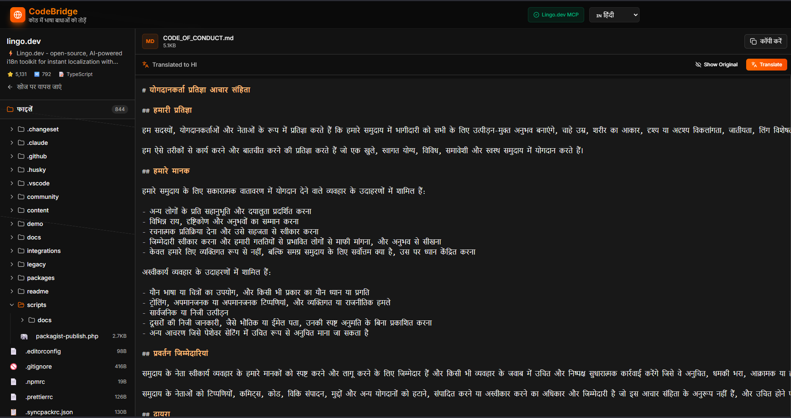

# CodeBridge - Lingo.dev MCP Integration Demo

**🌐 [Live Demo](https://codebridge-azure.vercel.app)** | **📚 [Documentation](./LINGO_MCP_INTEGRATION.md)**

CodeBridge is a developer tool designed to bridge language barriers in codebases. This demo showcases the integration of **Lingo.dev's MCP (Model Context Protocol)** to provide high-quality, context-aware translations for documentation and code comments.

## 🚀 Features

- **README Translation**: Automatically translate entire `README.md` files while preserving markdown structure and formatting.
- **Code Comment Translation**: Parse and batch translate comments within source code files (JavaScript, Python, Java, etc.) without breaking code syntax.
- **Context-Aware**: Uses Lingo.dev's AI engine to understand technical terminology and maintain the correct context.
- **Smart Locale Mapping**: Maps standard UI language codes to specific Lingo.dev locales (e.g., `ja` -> `ja-JP`).

## � Screenshots


*The main interface offering Code and README translation modes.*


*Real-time markdown translation preserving formatting.*

## �🛠️ Lingo.dev Features Highlighted

This project demonstrates the power of the [Lingo.dev SDK](https://lingo.dev/docs) specifically focusing on:

1.  **MCP Integration**: Leveraging the Model Context Protocol for seamless AI interactions.
2.  **Batch Processing**: Using `localizeStringArray` for efficient, bulk translation of code comments to reduce API latency.
3.  **Markdown Support**: Showcasing the engine's ability to handle complex markdown content in README files.

## 🏁 Getting Started

### Prerequisites

- Node.js (v16 or higher recommended)
- A [Lingo.dev](https://lingo.dev) API Key

### Installation

1.  Navigate to the project directory:
    ```bash
    cd community/codebridge-demo
    ```

2.  Install dependencies:
    ```bash
    npm install
    ```

3.  Configure your environment variables:
    - Create a `.env` file in the root of the demo folder (or copy `.env.example`).
    - Add your Lingo.dev API Key:
      ```env
      VITE_LINGO_API_KEY=your_lingo_api_key_here
      ```

### Running the App

Start the development server:

```bash
npm run dev
```

Open your browser and navigate to `http://localhost:5173` (or the URL shown in your terminal).

## 📖 How to Use

1.  **API Key Setup**: Ensure your API key is valid. The app header will show a "Lingo.dev MCP" badge (Green) if active.
2.  **Translate Documentation**:
    - Load a markdown content or file.
    - Select a target language.
    - Click "Translate" to see the preserved markdown translation.
3.  **Translate Code**:
    - Open a code file.
    - The app identifies comments.
    - Click "Translate" to convert comments to the target language while keeping the code intact.

## 📄 License

This project is licensed under the same terms as the Lingo.dev repository.
