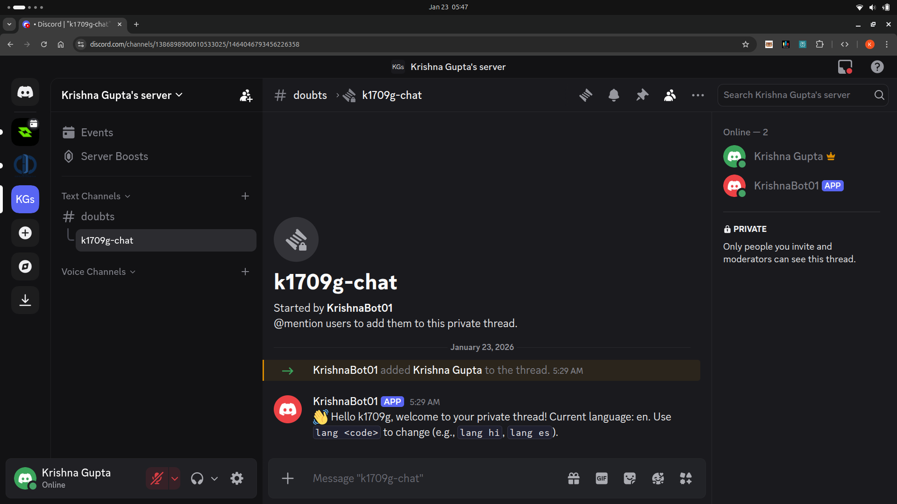
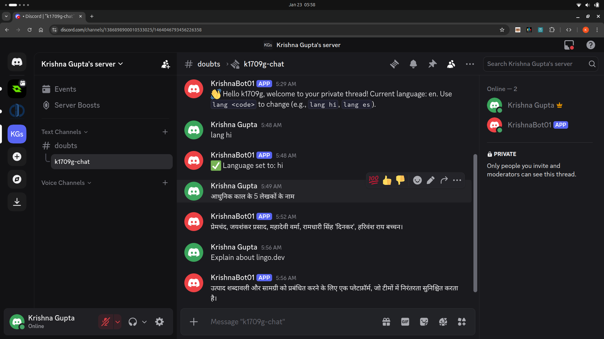
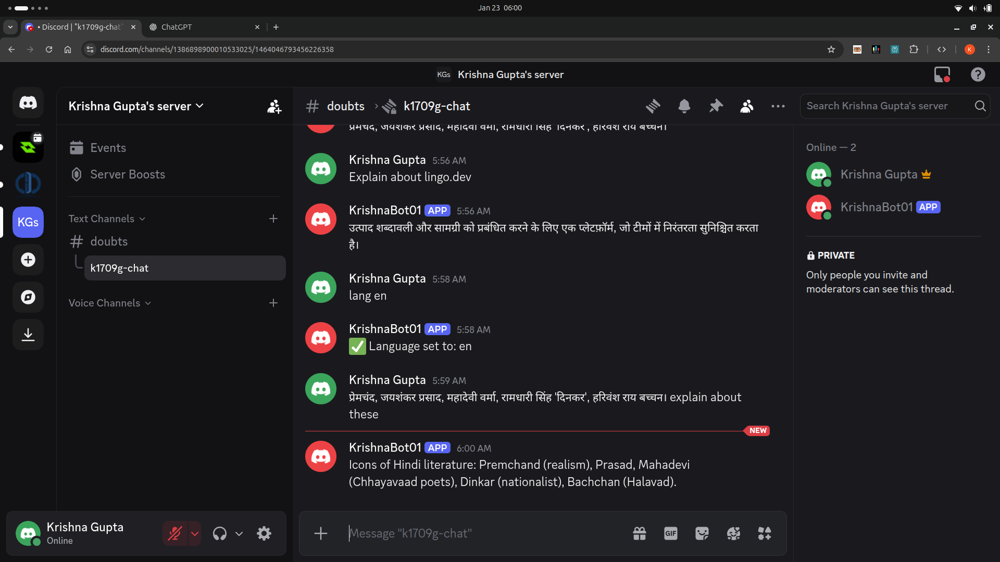

## Problem Statement

In Discord communities:
- Users often feel uncomfortable asking questions publicly
- Discord does not provide native, AI-driven multilingual conversations
- Most translation bots fail to preserve context, tone, and technical accuracy
- Managing private, multilingual support threads with admins is difficult

These limitations reduce participation and accessibility in global Discord servers.

---

## Proposed Solution

This project introduces a Discord bot that provides:
- Private, user-specific threads for sensitive or beginner questions
- AI-generated responses for faster support
- Accurate, context-aware multilingual replies using **Lingo.dev**
- Admin access to private threads for oversight and assistance
- Invite members in their private threads for collaborative support

The result is a **private, multilingual, AI-assisted support system** designed for global Discord communities.

---

## Why Lingo.dev?

**Lingo.dev is the core translation layer of this project.**

It is used because:
- It preserves **technical terms** and **developer context**
- It produces more natural translations than generic translators
- It is optimized for **developer-focused and AI-generated content**
- It avoids literal, robotic translations common in free APIs

### Problems Solved by Lingo.dev

| Problem | How Lingo.dev Solves It |
|------|------------------------|
| Loss of meaning in translations | Maintains semantic accuracy |
| Broken technical terms | Keeps code & tech vocabulary intact |
| Poor AI response localization | Produces natural, native-like language |
| Multi-language support complexity | Simple API with wide language coverage |
| Inconsistent user experience | Same quality across all languages |

Without Lingo.dev, AI responses often feel unnatural or misleading in non-English languages.

---

## Approach

1. When a user sends a trigger message ( ready ) in the parent channel, the bot creates a **private thread** for that user.
 
2. Inside the private thread:
   - The bot selects the language of responses by command (e.g., lang es for Spanish).
   - In MongoDB, the bot stores the selected language for that user.
   - I used command because language detection libraries are not 100% accurate. 
3. The user message is sent to **Google Gemini**, which generates a response in English.
4. The English response is translated using into selected language (retrieved from MongoDB using user ID) using **Lingo.dev**.
5. The translated response is sent back to the user in the **selected language** they chose.
 
6. Admins can join the private threads when mentioned or by browsing active threads to assist users as needed.
---

## Flow Diagram

Discord User (parent channel)  
↓  
Bot creates private thread  
↓  
Discord User (private thread)  
↓  
Discord Bot (discord.js)  
↓  
MongoDB (store selected language by user ID)  
↓  
Gemini API (generate response in English)  
↓  
**Lingo.dev (context-aware translation into selected language)**  
↓  
Discord Reply (user’s selected language)

---

## Why Not Use Simple Translation APIs?

- Most translation APIs focus on **general text**, not AI output
- They struggle with:
  - Programming terms
  - Mixed language sentences
  - Developer jargon
- Lingo.dev is designed specifically for **AI + developer workflows**

This makes it ideal for Discord support bots and multilingual communities.

---

## Prerequisites

- Node.js v22.18.0
- npm v11.6.1
- Discord Bot Token with send message and manage threads permissions
- Parent Channel ID where the bot listens for trigger messages (developer mode on for easy ID copy)
- Authorize the bot to your discord server with appropriate permissions
- Google Gemini API Key
- **Lingo.dev API Key**
- MongoDB URI

---

## Environment Variables

Create a `.env` file in the project root:

```env
BOT_LOGIN=DISCORD_BOT_TOKEN_HERE
GEMINI_API_KEY=YOUR_GEMINI_API_KEY_HERE
LINGO_API_KEY=YOUR_LINGO_API_KEY_HERE
MONGO_URL=YOUR_MONGO_URL_HERE
PARENT_CHANNEL_ID=YOUR_PARENT_CHANNEL_ID_HERE
PORT=YOUR_PORT_HERE
```

## Steps to Run and Test Locally

1. Install dependencies:
   npm install
2. Start the bot:
   npm start
3. In your Discord server, go to the parent channel and type `ready` to create a private thread.
4. Use `lang <language_code>` in the private thread to set your preferred response language (e.g., `lang es` for Spanish).
5. Ask your questions in the private thread and receive AI-generated, translated responses.
