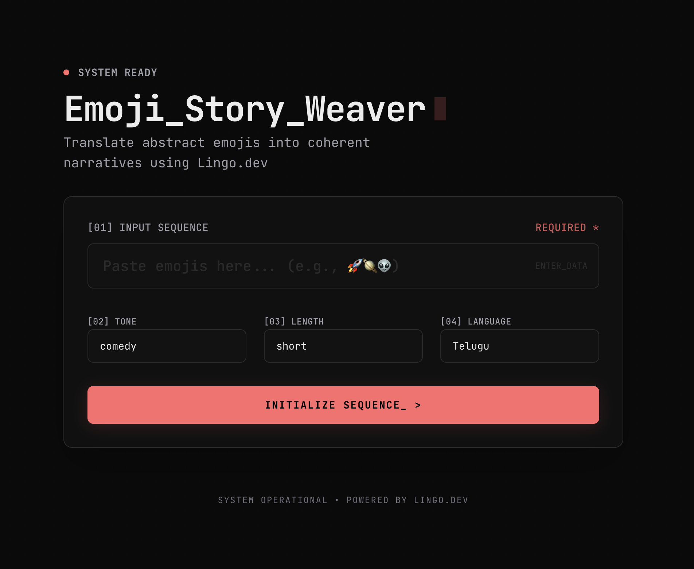
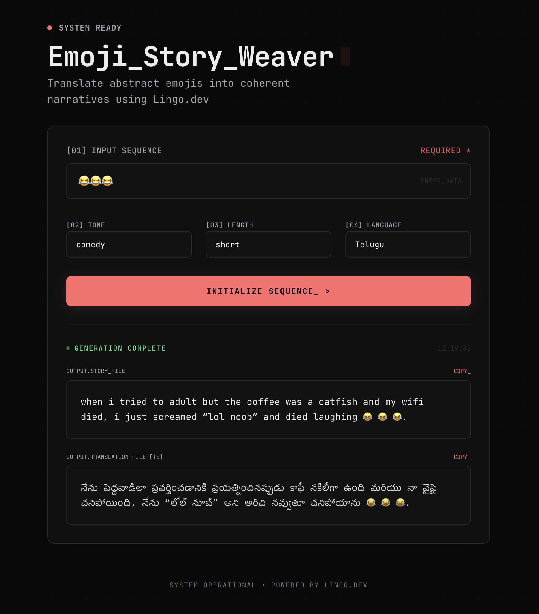

# Emoji Story Weaver

Transform abstract emojis into coherent narratives using AI. A terminal-style application that weaves stories from emojis and translates them into multiple languages.

<p align="center">
  <table width="100%">
    <tr>
      <th width="50%">Create Story</th>
      <th width="50%">Translated Output</th>
    </tr>
    <tr>
      <td></td>
      <td></td>
    </tr>
  </table>
</p>

## 🚀 Features

- **Emoji-to-Story Generation**: Uses Cloudflare AI (`@cf/openai/gpt-oss-120b`) to craft creative stories from your emoji inputs.
- **Multilingual Support**: Instantly translates generated stories into 9+ languages (Spanish, French, German, Hindi, etc.) using [Lingo.dev](https://lingo.dev).
- **Customizable Output**:
  - **Tone**: Comedy, Drama, Epic, Horror, Romance.
  - **Length**: Short (single sentence), Medium, Epic.
  - **Style**: Optimized for internet slang and viral-worthy content.
- **Terminal UI**: A premium, clean, dark-themed interface with "System Ready" aesthetics.
- **Smooth Animations**: Powered by Framer Motion for a fluid user experience.

## 🛠️ Tech Stack

- **Framework**: [Next.js 16](https://nextjs.org/) (App Router)
- **Styling**: [Tailwind CSS v4](https://tailwindcss.com/)
- **AI**: [Cloudflare Workers AI](https://developers.cloudflare.com/workers-ai/)
- **Localization**: [Lingo.dev](https://lingo.dev/)
- **Animations**: [Framer Motion](https://www.framer.com/motion/)
- **Deployment**: [OpenNext](https://opennext.js.org/) on Cloudflare

## ✅ Prerequisites

Before running this project, ensure you have:

- **Node.js**: v18.17.0 or later
- **Cloudflare Account**: With Workers AI enabled and API Token.
- **Lingo.dev Account**: For translation API keys.

## 💻 How to Run Locally

1. **Install dependencies**
   ```bash
   bun install
   # or
   npm install
   ```

2. **Configure Environment**
   Create a `.dev.vars` or `.env` file with your API keys:
   ```env
   CLOUDFLARE_API_TOKEN=your_token
   LINGO_DEV_API_KEY=your_key
   ```

3. **Run the development server**
   ```bash
   bun run dev
   # or
   npm run dev
   ```

   Open [http://localhost:3000](http://localhost:3000) with your browser to see the result.