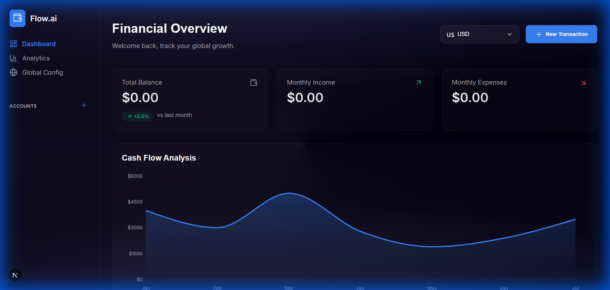
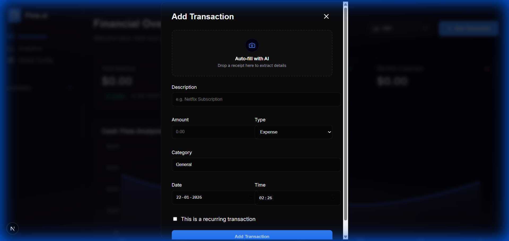

# 💰 Finance AI Flow - Smart Financial Dashboard

A modern, AI-powered financial dashboard that helps you track expenses, visualize cash flow, and manage multi-currency transactions with intelligent receipt scanning.

Built for the **Lingo.dev Community Showcase** to demonstrate elegant UI/UX design with real-time data visualization and smart automation.

   

---

## 🚀 Live Demo

**[View Live Demo →](https://finance-ai-flow-8nyq37w5p-khushis-projects-39c3139a.vercel.app)**

Experience the full-featured financial dashboard with real-time updates and smooth animations.

---

## ✨ Features

- 💸 **Transaction Management**: Add, edit, and categorize income/expenses with date & time precision
- 🤖 **AI Receipt Scanning**: Mock AI-powered receipt auto-fill (drag & drop simulation)
- 📊 **Cash Flow Visualization**: Interactive area charts powered by Recharts
- 🌍 **Multi-Currency Support**: USD, EUR, JPY, and **INR (Indian Rupees)** with real-time formatting
- ✨ **Smooth Animations**: Framer Motion-powered entry animations for delightful UX
- 🏦 **Account Tracking**: Manage multiple accounts (checking, savings, credit)
- 🌙 **Dark Mode First**: Beautiful glassmorphism design optimized for dark theme
- 📱 **Fully Responsive**: Optimized for mobile, tablet, and desktop experiences
- 🎯 **Empty State Design**: Engaging prompts to guide users from scratch

---

## 🎯 Key Highlights

This project showcases:

- **Reactive State Management**: React hooks managing complex transaction and account states
- **Data Visualization**: Recharts integration for dynamic cash flow analysis
- **Micro-Interactions**: Framer Motion animations for cards, lists, and modals
- **Smart Forms**: Date/time pickers, currency selectors, and validation
- **Glassmorphism UI**: Modern design with backdrop blur and gradient effects
- **Empty State UX**: Interactive overlays that encourage user action

---

## 🚀 Quick Start

### Prerequisites

- **Node.js**: v18 or higher
- **Package Manager**: npm, pnpm, or yarn

### Installation

1. **Clone the repository:**

```bash
git clone https://github.com/lingodotdev/lingo.dev.git
cd lingo.dev/community/finance-ai-flow
```

2. **Install dependencies:**

```bash
npm install
# or
pnpm install
# or
yarn install
```

3. **(Optional) Set up environment variables for Lingo.dev SDK:**

```bash
cp .env.example .env.local
```

Then edit `.env.local` and add your Lingo.dev API key (for future localization features):

```env
LINGODOTDEV_API_KEY=your_lingo_api_key_here
```

> **Note**: The app works without the API key. This is only needed if you want to extend the app with Lingo.dev SDK features.

4. **Start the development server:**

```bash
npm run dev
# or
pnpm dev
# or
yarn dev
```

5. **Open your browser:**

Navigate to [http://localhost:3000](http://localhost:3000)

---

## 🏗️ Tech Stack

| Technology | Purpose |
|------------|---------|
| **Next.js 16** | React framework with App Router |
| **React 19** | UI library with latest features |
| **TypeScript** | Type-safe development |
| **Recharts** | Data visualization library |
| **Framer Motion** | Animation library |
| **Lucide React** | Beautiful icon set |
| **Vanilla CSS** | Custom styling with CSS variables |

---

## 📁 Project Structure

```
finance-ai-flow/
├── app/
│   ├── components/
│   │   ├── AccountModal.tsx      # Add account modal
│   │   ├── TransactionModal.tsx  # Add/Edit transaction modal
│   │   ├── CurrencySelector.tsx  # Multi-currency dropdown
│   │   └── OverviewChart.tsx     # Cash flow area chart
│   ├── globals.css               # Global styles and animations
│   ├── layout.tsx                # Root layout with metadata
│   ├── page.tsx                  # Main dashboard page
│   └── types.ts                  # TypeScript interfaces
├── public/
│   └── screenshots/              # App screenshots for PR
│       ├── dashboard.png
│       └── modal_ai.png
└── README.md                     # This file
```

---

## 🎨 Key Components

### 1. **Transaction Management**
- Add transactions with **description, amount, type, category, date, and time**
- Edit existing transactions
- Mark transactions as **recurring**
- AI Receipt Scanning: Drag & drop receipts to auto-fill transaction details (simulated)

### 2. **Cash Flow Visualization**
- **Interactive Area Chart**: Visualizes monthly cash flow trends
- **Empty State**: Encouraging overlay when no data exists
- **Dynamic Data**: Chart responds to transaction additions

### 3. **Multi-Currency Support**
- **Custom Dropdown**: Animated currency selector with flags
- **Supported Currencies**: USD 🇺🇸 • EUR 🇪🇺 • JPY 🇯🇵 • **INR 🇮🇳**
- **Real-time Formatting**: Proper locale-based number formatting

### 4. **Smart Animations**
- **Entry Animations**: Staggered fade-in for dashboard cards
- **List Animations**: Individual transaction items animate in sequence
- **Modal Transitions**: Smooth backdrop blur and scale effects

---

## 💱 Supported Currencies

| Currency | Locale | Symbol |
|----------|--------|--------|
| US Dollar | `en-US` | $ |
| **Indian Rupee** | `en-IN` | ₹ |
| Euro (Germany) | `de-DE` | € |
| Euro (France) | `fr-FR` | € |
| Japanese Yen | `ja-JP` | ¥ |

---

## 🎯 Getting Started (First Use)

1. **Add an Account**: Click "Add Account" in the sidebar to create your first financial account
2. **Add a Transaction**: Click "+ New Transaction" in the header or use the chart overlay prompt
3. **Try AI Scanning**: In the transaction modal, drag & drop or click the AI scanning area to simulate receipt auto-fill
4. **Switch Currencies**: Use the currency selector in the header to view amounts in different formats
5. **Watch Charts Update**: Your cash flow chart will come alive as you add transactions

---

## 🤝 Contributing

This project is part of the **Lingo.dev community examples**. Feel free to:

- 🐛 Report issues
- 💡 Suggest improvements  
- 🔧 Submit pull requests
- 🚀 Use as a starting point for your own financial apps

---

## 📄 License

This project is licensed under the same terms as the parent [Lingo.dev repository](https://github.com/lingodotdev/lingo.dev).

---

## 🙏 Acknowledgments

- **Charts**: Powered by [Recharts](https://recharts.org/)
- **Animations**: Powered by [Framer Motion](https://www.framer.com/motion/)
- **Icons**: [Lucide React](https://lucide.dev/)
- **Inspiration**: Modern fintech dashboards and glassmorphism design trends

---

**Built with ❤️ for the Lingo.dev Community Showcase**

---

## 📸 Screenshots

### Dashboard Overview


### AI Receipt Scanning

