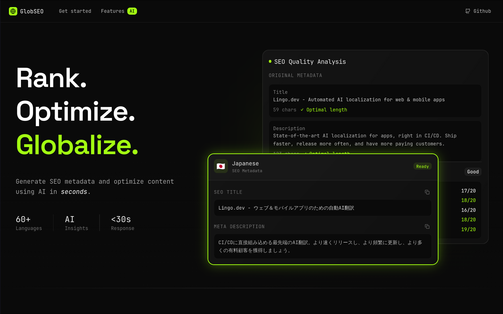
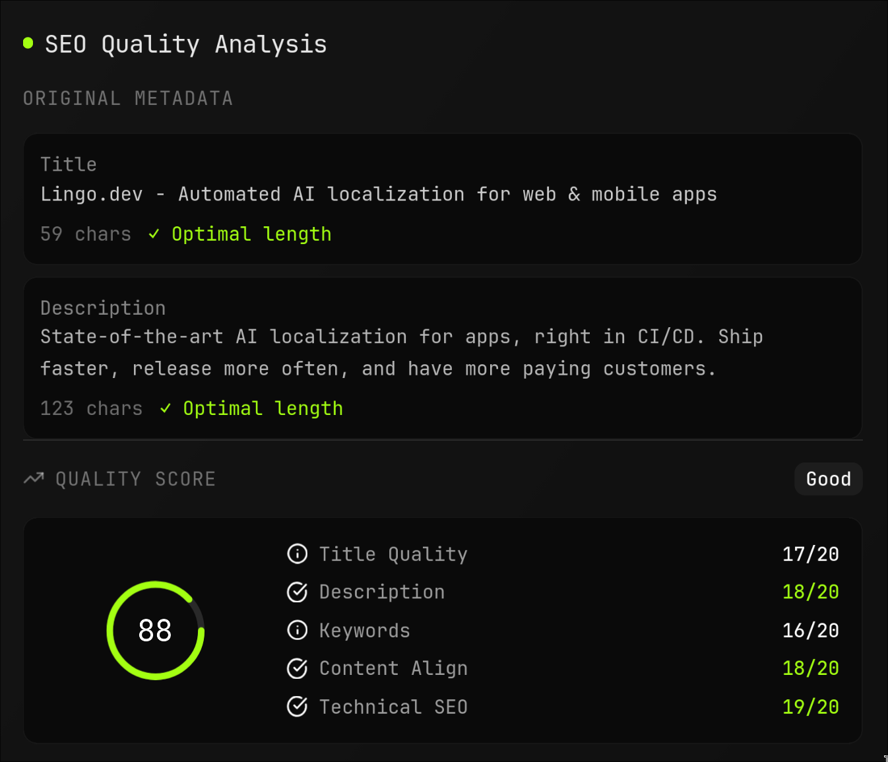
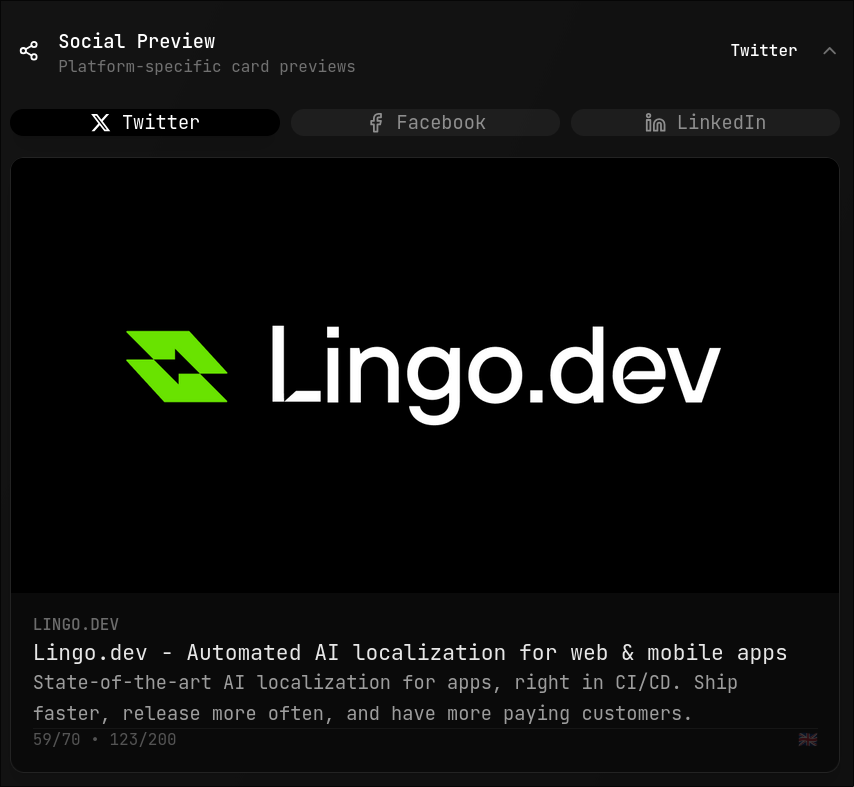
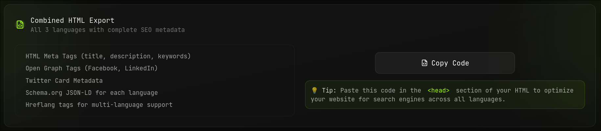

# GlobSEO



GlobSEO analyzes website metadata, translates it to multiple languages using the [Lingo.dev](https://lingo.dev) SDK, and provides SEO scoring to help optimize content for global audiences. Whether you need English-only analysis or full multilingual SEO optimization, GlobSEO delivers professional-grade results with intelligent caching and comprehensive API support.

## Features

- **Metadata Extraction**: Scrapes title, description, keywords, Open Graph tags, and Twitter Card data from web pages
- **Multi-language Translation**: Translates metadata using Lingo.dev's translation service (optional)
- **Supported Languages**: 15+ languages including Spanish, French, German, Italian, Portuguese, Japanese, Korean, Chinese, Arabic, Russian, Dutch, Polish, Turkish, Swedish, and Danish
- **Smart Rewrite Suggestions**: AI-powered content improvement recommendations
- **Schema Markup Generation**: Automatic generation of structured data markup
- **Social Card Previews**: Live previews of how content appears on social media platforms
- **Code Generation**: Ready-to-use HTML meta tags, JSON-LD, and social media cards
- **Metadata Quality Scoring**: Comprehensive analysis of title, description, and keyword optimization
- **Caching System**: Optimizes performance by caching translation results with Redis
- **Rate Limiting**: Built-in rate limiting to prevent abuse
- **i18n Integration**: Can update frontend internationalization files with translated content
- **Modern UI**: Built with React 19, TypeScript, and Tailwind CSS using Radix UI components
- **Responsive Design**: Optimized for desktop and mobile devices
- **Dark Theme**: Modern dark theme with professional aesthetics
- **REST API**: Comprehensive API for integration with other tools

## Screenshots

|  |
| :------------------------------------------: |
| *SEO Quality Analysis* |

|  |  |
| :-------------------------------------------------: | :-----------------------------------------------: |
| *Japanese Translation Result* | *Social Media Card Preview* |

|  |
| :------------------------------------------: |
| *Copy Button* |
## Installation

### Prerequisites

- Node.js 18 or later
- npm or yarn

### Backend Setup

1. Navigate to the backend directory:
   ```bash
   cd backend
   ```

2. Install dependencies:
   ```bash
   npm install
   ```

3. Install Playwright browsers:
   ```bash
   npm run install-browsers
   ```

4. Copy the environment variables file and configure your API keys:
   ```bash
   cp .env.example .env
   ```
   
   Then edit `.env` with your actual API keys and configuration:
   - `GEMINI_API_KEY`: Your Google Gemini API key for SEO analysis (required)
   - `LINGODOTDEV_API_KEY`: Your Lingo.dev API key for translations (required for multilingual analysis)
   - `UPSTASH_REDIS_REST_URL`: Your Upstash Redis REST URL for caching (optional, falls back to in-memory cache)
   - `UPSTASH_REDIS_REST_TOKEN`: Your Upstash Redis REST token for caching (optional, falls back to in-memory cache)
   - `CACHE_EXPIRY_SECONDS`: Cache expiry time in seconds (default: 86400 = 24 hours)
   - `PORT`: Backend server port (default: 3001)
   - `NODE_ENV`: Environment mode (development/production)

### Frontend Setup

1. Navigate to the frontend directory:
   ```bash
   cd frontend
   ```

2. Install dependencies:
   ```bash
   npm install
   ```

## Usage

### Running the Application

1. Start the backend server:
   ```bash
   cd backend
   npm run dev
   ```

2. In a new terminal, start the frontend:
   ```bash
   cd frontend
   npm run dev
   ```

3. Open your browser to `http://localhost:5173`

### Basic Workflow

1. Enter a website URL in the input field
2. Select target languages for translation (optional - English-only analysis available)
3. Click "Analyze" to start the process
4. View the results showing original metadata, SEO scores, and translations (if requested)

### API Usage

The backend provides multiple REST API endpoints for different use cases:

#### Complete Pipeline (Scrape + Translate + Score)
```bash
curl -X POST http://localhost:3001/api/scrape-translate-score \
  -H "Content-Type: application/json" \
  -d '{
    "url": "https://example.com",
    "languages": ["es", "fr", "de"],
    "primaryKeyword": "example keyword"
  }'
```

#### Scrape and Score Only (English)
```bash
curl -X POST http://localhost:3001/api/scrape-and-score \
  -H "Content-Type: application/json" \
  -d '{
    "url": "https://example.com",
    "primaryKeyword": "example keyword"
  }'
```

#### Individual Operations
```bash
# Scrape metadata only
curl -X POST http://localhost:3001/api/scrape \
  -H "Content-Type: application/json" \
  -d '{"url": "https://example.com"}'

# Scrape and translate only
curl -X POST http://localhost:3001/api/translate \
  -H "Content-Type: application/json" \
  -d '{"url": "https://example.com", "languages": ["es", "fr"]}'

# Generate SEO score for existing metadata
curl -X POST http://localhost:3001/api/seo-score \
  -H "Content-Type: application/json" \
  -d '{"url": "https://example.com", "title": "Page Title", "description": "Page description"}'
```

#### Health Check
```bash
curl http://localhost:3001/api/health
```

### Testing

Run backend tests:

```bash
cd backend
node tests/test-seo-score.js
node tests/test-lingo-translate.js
node tests/test-optimizations.js
```

### Integration Testing

Run individual backend tests for specific functionality:

```bash
cd backend
node tests/test-seo-score.js
node tests/test-lingo-translate.js
node tests/test-optimizations.js
```

For comprehensive integration testing, create a custom test script that exercises the full pipeline.

Configuration is managed through `backend/config.json`:

- `defaultLanguages`: Default target languages for translation (e.g., ["es", "fr"])
- `supportedLanguages`: All available language codes for translation
- `scraper.timeout`: Timeout for web scraping operations (milliseconds)
- `scraper.waitUntil`: Playwright wait condition ("domcontentloaded", "load", "networkidle")
- `scraper.headless`: Whether to run browser in headless mode
- `translation.provider`: Translation service provider ("lingo")
- `translation.fallbackEnabled`: Whether to enable fallback translation methods
- `output.directory`: Directory for saving generated metadata files
- `output.updateI18n`: Whether to update frontend i18n files with translations
- `output.i18nDirectory`: Path to frontend i18n directory
- `metadata.fieldsToTranslate`: Which metadata fields to translate
- `logging.colors`: ANSI color codes for console output
- `logging.levels`: Log level to color mapping for consistent logging

### Environment Variables

Required:
- `GEMINI_API_KEY`: Google Gemini API key for SEO analysis
- `LINGODOTDEV_API_KEY`: Lingo.dev API key for translations

Optional:
- `PORT`: Server port (default: 3001)
- `UPSTASH_REDIS_REST_URL`: Upstash Redis REST URL for caching (optional, falls back to in-memory cache)
- `UPSTASH_REDIS_REST_TOKEN`: Upstash Redis REST token for caching (optional, falls back to in-memory cache)
- `CACHE_EXPIRY_SECONDS`: Cache TTL in seconds (default: 86400 - 24 hours)
- `NODE_ENV`: Environment mode ("development", "production")

## Tech Stack

### Backend
- **Runtime**: Node.js 18+
- **Framework**: Express.js
- **Web Scraping**: Playwright (headless browser automation)
- **HTML Parsing**: Cheerio
- **AI Integration**: Google Generative AI (Gemini) for SEO analysis
- **Translation Service**: Lingo.dev SDK for professional translations
- **Caching**: Upstash Redis (with in-memory fallback)
- **Rate Limiting**: Express rate limiting middleware
- **HTTP Client**: Axios
- **Logging**: Custom ANSI color-coded logging system
- **Environment**: dotenv for configuration management

### Frontend
- **Framework**: React 19 with TypeScript
- **Build Tool**: Vite
- **Styling**: Tailwind CSS with PostCSS and Autoprefixer
- **UI Components**: Radix UI (headless component library)
- **Icons**: Lucide React
- **State Management**: React hooks
- **Internationalization**: Custom i18n system with 60+ language support
- **Linting**: ESLint with TypeScript support
- **Theme**: next-themes for dark/light mode

### Development & Testing
- **Version Control**: Git
- **Package Management**: npm
- **Testing**: Custom integration tests
- **Code Quality**: ESLint, TypeScript strict mode
- **Browser Automation**: Playwright for E2E testing

### Infrastructure & Deployment
- **Database**: Redis (Upstash cloud or local)
- **API**: RESTful endpoints with JSON responses
- **Caching Strategy**: MD5-based cache keys with TTL
- **Error Handling**: Comprehensive try-catch with user-friendly messages
- **Security**: Rate limiting, input validation, CORS

## Project Structure

```bash
├── README.md                    # Project documentation
├── TRANSLATION_FLOW.md          # Detailed translation pipeline documentation
├── assets/
│   └── screenshots/             # Application screenshots
├── backend/                     # Node.js API server
│   ├── server.js                # Main Express server
│   ├── pipeline.js              # Translation pipeline logic
│   ├── config.json              # Configuration settings
│   ├── package.json             # Backend dependencies
│   ├── output/                  # Generated metadata files
│   ├── tests/                   # Backend test files
│   │   ├── test-lingo-translate.js
│   │   ├── test-optimizations.js
│   │   └── test-seo-score.js
│   └── utils/                   # Utility modules
│       ├── scraper.js           # Web scraping functionality
│       ├── lingo-translate.js   # Translation handling
│       ├── seo-score.js         # SEO analysis
│       ├── cache-utils.js       # Caching utilities
│       └── rate-limiter.js      # Rate limiting
├── frontend/                    # React application
│   ├── index.html               # Main HTML file
│   ├── package.json             # Frontend dependencies
│   ├── vite.config.ts           # Vite configuration
│   ├── tailwind.config.js       # Tailwind CSS config
│   ├── postcss.config.js        # PostCSS configuration
│   ├── tsconfig.json            # TypeScript configuration
│   ├── eslint.config.js         # ESLint configuration
│   ├── i18n.json                # i18n configuration
│   ├── i18n/                    # Translation files (100+ languages)
│   ├── public/                  # Static assets
│   └── src/                     # Source code
└── assets/                      # Project assets
```

## Development

### Available Scripts

#### Backend Scripts
```bash
cd backend

# Development server with auto-restart
npm run dev

# Production server
npm start

# Install Playwright browsers (required for scraping)
npm run install-browsers

# Individual operations
npm run scrape          # Scrape metadata from URL
npm run scrape-score    # Scrape and generate SEO score
npm run translate       # Translate existing metadata
npm run lingo          # Run Lingo.dev translation
npm run pipeline       # Run complete pipeline

# Testing
node tests/test-seo-score.js
node tests/test-lingo-translate.js
node tests/test-optimizations.js
```

#### Frontend Scripts
```bash
cd frontend

# Development server
npm run dev

# Build for production
npm run build

# Preview production build
npm run preview

# Lint code
npm run lint
```

### Integration Testing

Run individual backend tests for specific functionality:

```bash
cd backend
node tests/test-seo-score.js
node tests/test-lingo-translate.js
node tests/test-optimizations.js
```

For comprehensive integration testing, create a custom test script that exercises the full pipeline.

## License

MIT License
