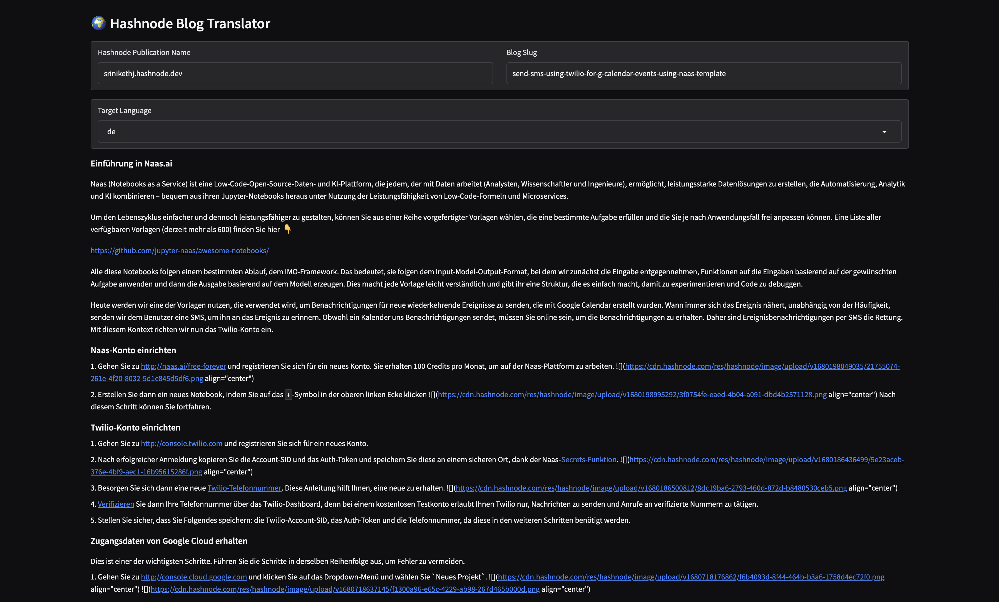
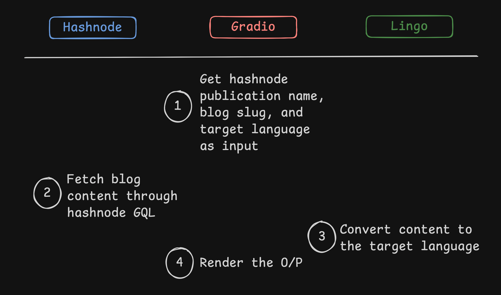

# 🗣️ Hashnode Blog Translator


An app to extract and translate blog content from Hashnode and convert to a target language by preserving localization through Lingo.dev. Built in Python and designed for quick local runs and deployments.

---

## 🔎 Overview

Hashnode Blog Translator is a powerful tool designed for content creators who want to reach a global audience. It fetches your blog posts directly from Hashnode via its GraphQL API, leverages **Lingo.dev** for high-quality, locale-aware translations, and provides a clean Markdown output through a user-friendly **Gradio** web interface.

## 🚀 Features

- 📝 **Automated Fetching**: Retrieves full blog content (titles and markdown) from any Hashnode publication.
- 🌐 **Smart Translation**: Uses [Lingo.dev](https://lingo.dev) to translate content while preserving technical formatting and localization nuances.
- 🌍 **Language Detection**: Automatically detects the source language of your title and content.
- 💻 **Gradio Web UI**: Simple, interactive interface for localized blog generation.
- ⚡ **Asynchronous Processing**: Built with `httpx` and `asyncio` for fast, non-blocking performance.
- 🐳 **Docker Ready**: Includes a multi-stage Dockerfile for easy deployment.

## 🛠️ Tech Stack

- **Language**: Python 3.12+
- **Web Interface**: [Gradio](https://www.gradio.app/)
- **Translation Engine**: [Lingo.dev Python SDK](https://lingo.dev/en/cli/quick-start)
- **HTTP Client**: [httpx](https://www.python-httpx.org/)
- **Data Validation**: [Pydantic](https://docs.pydantic.dev/)
- **Package Management**: [uv](https://github.com/astral-sh/uv)

## 📋 Prerequisites

- **Python 3.12** or higher.
- **Lingo.dev API Key**: Get it from [lingo.dev](https://lingo.dev/en/cli/quick-start).
- **Hashnode Access Token**: Generate it at [hashnode.com/settings/developer](https://hashnode.com/settings/developer).
- **Hashnode Publication Host**: The domain of your blog (e.g., `srinikethj.hashnode.dev`).

## 🖼️ Output



## ⚙️ Setup & Installation

### 1. Clone the repository

```bash
git clone https://github.com/lingodotdev/lingo.dev.git
cd lingo.dev/hashnode-blog-translator
```

### 2. Environment Configuration

Create a `.env` file in the root directory:

```bash
cp .env.sample .env
```

Edit the `.env` file with your credentials:

```env
HASHNODE_BASE_URL="https://gql.hashnode.com"
HASHNODE_API_KEY="your_hashnode_token"
LINGODOTDEV_API_KEY="your_lingo_dev_key"
GRADIO_SERVER_PORT=7860
```

### 3. Install Dependencies

We recommend using [uv](https://github.com/astral-sh/uv) for fast dependency management:

```bash
uv sync
```

Or using standard `pip`:

```bash
python -m venv .venv
source .venv/bin/activate
pip install -r requirements.txt  # If requirements.txt is provided, otherwise use pyproject.toml
```

## 🏗️ How It Works



1. **Input**: User provides the Hashnode publication name, the blog slug, and the target language.
2. **Fetch**: The app queries the Hashnode GraphQL API to retrieve the raw markdown content.
3. **Analyze**: Lingo.dev detects the source language of the blog.
4. **Localize**: The content is processed by the Lingo.dev engine to produce a localized version in the target language.
5. **Render**: The translated markdown is displayed in the Gradio interface, ready for review or export.

## 🖥️ Running the App

### Local Run

```bash
uv run app.py
```

Navigate to `http://localhost:7860` in your browser.

### Docker Run

```bash
docker build -t hashnode-translator .
docker run -p 7860:7860 --env-file .env hashnode-translator
```

## 📝 Example Configuration

To fetch a specific blog post, use parameters like:

- **Hashnode Publication Name**: `srinikethj.hashnode.dev`
- **Blog Slug**: `send-sms-using-twilio-for-g-calendar-events-using-naas-template`
- **Target Language**: `de` (German)

## ✅ Limitations & Notes

- **Language Match**: If the detected source language matches the target language, the translation process is skipped.
- **Images**: Currently, external images in the markdown may not render inside the Gradio preview depending on their hosting policy.

## 📄 License

This project is licensed under the MIT License.
