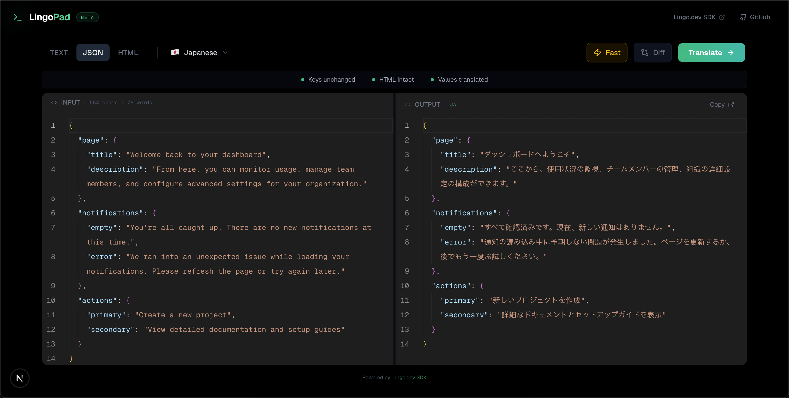

# 🌐 LingoPad

**Structure-Safe AI Translation for Developers**

LingoPad is a developer-focused translation tool that preserves your data structure while translating content. Built with the [Lingo.dev SDK](https://lingo.dev/en/sdk), it intelligently handles JSON, HTML, and plain text — keeping keys, tags, and formatting intact.

[**Live Demo →**](https://lingo-pad.anishroy.com/)




---

## ✨ Features

- **🔑 Keys Unchanged** — JSON keys remain untranslated, only values are localized
- **🏷️ HTML Intact** — HTML tags and attributes are preserved perfectly
- **📝 Smart Detection** — Automatically handles text, JSON, and HTML content
- **⚡ Fast Mode** — Quick translations for drafts and real-time use
- **✨ Quality Mode** — Nuanced, context-aware translations for production
- **🔍 Diff View** — See exactly what changed between original and translated
- **⌨️ Keyboard Shortcuts** — `⌘/Ctrl + Enter` for quick translation

---

## 🛠️ Lingo.dev Highlights

LingoPad serves as a practical implementation of the [Lingo.dev JavaScript SDK](https://lingo.dev/en/sdk), highlighting several key features:

- **Structural Preservation (`localizeObject`)**: Demonstrates how nested JSON objects can be translated without corrupting keys or layout.
- **Markup Safety (`localizeHtml`)**: Showcases the ability to translate content within complex HTML without affecting tags or attributes.
- **Contextual Nuance (`localizeText`)**: Standard text translation using high-quality AI models.
- **Translation Parameters**: Implementation of the `fast: true/false` toggle to balance speed and nuance.
- **Automatic Detection**: Usage of the `sourceLocale: null` parameter to allow the SDK to automatically detect source languages.

---

## 🚀 Getting Started

### Prerequisites

- Node.js 18+
- A [Lingo.dev API Key](https://lingo.dev)

### Installation

```bash
# Clone the repository
git clone https://github.com/lingodotdev/lingo.dev.git
cd lingo.dev/community/lingo-pad

# Install dependencies
npm install

# Set up environment variables
cp .env.example .env
# Add your LINGO_API_KEY to .env

# Start the development server
npm run dev
```

Open [http://localhost:3000](http://localhost:3000) to use LingoPad.

---

## 🛠️ Tech Stack

| Technology                                                  | Purpose                         |
| ----------------------------------------------------------- | ------------------------------- |
| [Next.js 16](https://nextjs.org)                            | React framework with App Router |
| [TypeScript](https://typescriptlang.org)                    | Type-safe development           |
| [Tailwind CSS](https://tailwindcss.com)                     | Utility-first styling           |
| [Monaco Editor](https://microsoft.github.io/monaco-editor/) | VS Code-like editor experience  |
| [Lingo.dev SDK](https://lingo.dev/en/sdk)                   | AI-powered translation engine   |
| [Lucide Icons](https://lucide.dev)                          | Beautiful icon library          |

---

## 📁 Project Structure

```
lingo-pad/
├── app/
│   ├── api/
│   │   └── translate/       # Translation API endpoint
│   ├── components/
│   │   ├── control-bar.tsx  # Input type, language, mode controls
│   │   ├── editor-panel.tsx # Monaco editor wrapper
│   │   ├── empty-state.tsx  # Empty/loading states
│   │   ├── header.tsx       # App header
│   │   └── toast.tsx        # Toast notifications
│   ├── utils/
│   │   ├── diff-utils.ts    # Diff computation for highlighting
│   │   └── presets.ts       # Example content presets
│   ├── globals.css          # Global styles
│   ├── layout.tsx           # Root layout
│   └── page.tsx             # Main application
├── public/                  # Static assets
└── package.json
```

---

## 🎯 Usage Examples

### JSON Translation

```json
// Input
{
  "welcome": "Welcome to our app",
  "cta": "Get Started"
}

// Output (Spanish)
{
  "welcome": "Bienvenido a nuestra aplicación",
  "cta": "Comenzar"
}
```

### HTML Translation

```html
<!-- Input -->
<h1>Hello World</h1>
<p class="intro">Welcome to our platform</p>

<!-- Output (French) -->
<h1>Bonjour le monde</h1>
<p class="intro">Bienvenue sur notre plateforme</p>
```

---

## ⚙️ Environment Variables

| Variable              | Description            | Required |
| --------------------- | ---------------------- | -------- |
| `LINGODOTDEV_API_KEY` | Your Lingo.dev API key | ✅       |

---

## 🤝 Contributing

Contributions are welcome! Please feel free to submit a Pull Request.

1. Fork the repository
2. Create your feature branch (`git checkout -b feature/amazing-feature`)
3. Commit your changes (`git commit -m 'Add amazing feature'`)
4. Push to the branch (`git push origin feature/amazing-feature`)
5. Open a Pull Request

---

## 📄 License

This project is part of the [Lingo.dev](https://lingo.dev) ecosystem and is licensed under the MIT License.

---

## 🔗 Links

- [Live Demo](https://lingo-pad.anishroy.com/)
- [Lingo.dev](https://lingo.dev) — AI Translation Platform
- [Lingo.dev SDK Documentation](https://lingo.dev/en/sdk)
- [GitHub Repository](https://github.com/lingodotdev/lingo.dev)

---

<p align="center">
  Made with ❤️ by the <a href="https://lingo.dev">Lingo.dev</a> community
</p>
