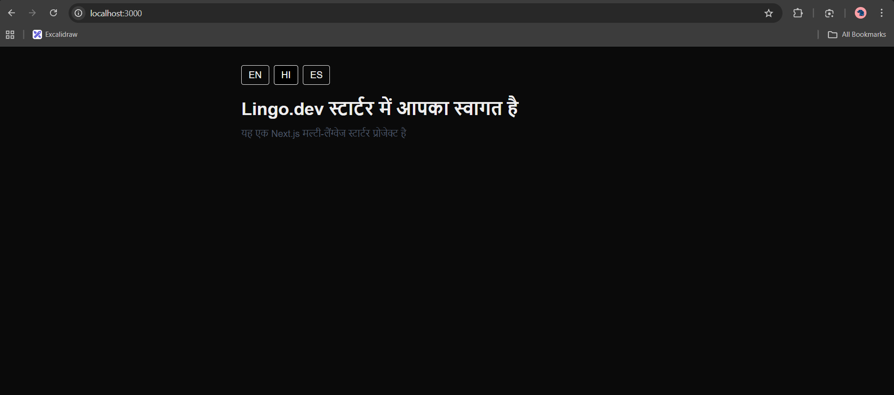
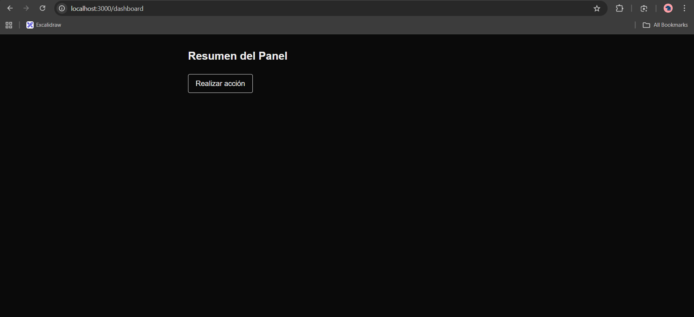

# Next.js + Lingo.dev Starter

A minimal, production-ready starter template demonstrating how to build multilingual applications using Next.js App Router and Lingo.dev.

This project is designed as a community starter and demo to help developers quickly understand and integrate localization using Lingo.dev.

---

## 🚀 Features

- 🌍 Multilingual support (English, Hindi, Spanish)
- 🔄 Language persistence using localStorage
- 🧱 Next.js App Router architecture
- 📄 Real-world demo page (`/dashboard`)
- 🧩 Reusable language switcher component
- 📦 Clean and extendable project structure

---

## Screenshots:

### 🏠 Home Page

The home page demonstrates basic multilingual support using Lingo.dev with a simple language switcher.
Users can switch languages instantly, with their preference persisted across page reloads.



---

### 📊 Dashboard Page

The dashboard page simulates a real-world SaaS screen to showcase multi-page localization.
It highlights how translated content remains consistent across routes and user interactions.



## 🛠 Tech Stack

- **Framework:** Next.js (App Router)
- **Localization:** Lingo.dev
- **Styling:** Tailwind CSS
- **Language files:** JSON-based messages

---

## 📂 Project Structure

```txt
src/
 ├── app/
 │   ├── page.tsx
 │   └── dashboard/
 │       └── page.tsx
 ├── components/
 │   └── LanguageSwitcher.tsx
 ├── lib/
 │   └── lingo.ts
 └── messages/
     ├── en.json
     ├── hi.json
     └── es.json
```

## 🖥 System Requirements

- Node.js 18+

- npm / pnpm / yarn

- Lingo.dev API key

## 🔐 Environment Variables

- Create a `.env.local` file:

```bash
LINGO_API_KEY=your_lingo_api_key_here
```

## ▶️ Running Locally

```bash
npm install
npm run dev
```

Open http://localhost:3000

## ➕ Adding a New Language

1. Create a new JSON file in src/messages/

2. Add translation keys

3. Update the language switcher

4. Done ✅

## 🎯 Purpose

- This starter exists to help developers:

- Get started with Lingo.dev in minutes

- Learn localization best practices

- Use a clean and scalable Next.js setup
