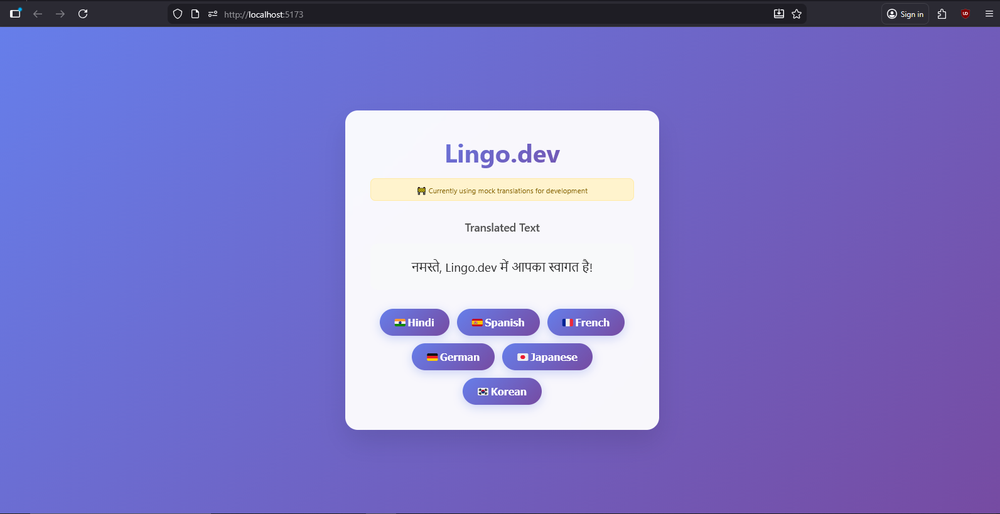

# React Language Switcher (Lingo.dev Community)

A simple React demo showing how to translate text using the Lingo.dev API.

## 🚀 Features
- Translate text into multiple languages
- Beginner-friendly React example
- Secure API key usage via environment variables

## 📦 Prerequisites
- Node.js 18+
- Lingo.dev API key

## 🔐 Environment Variables

Create a `.env` file:

REACT_APP_LINGO_API_KEY=your_api_key_here

## ▶️ Run Locally

```bash
npm install
npm start
